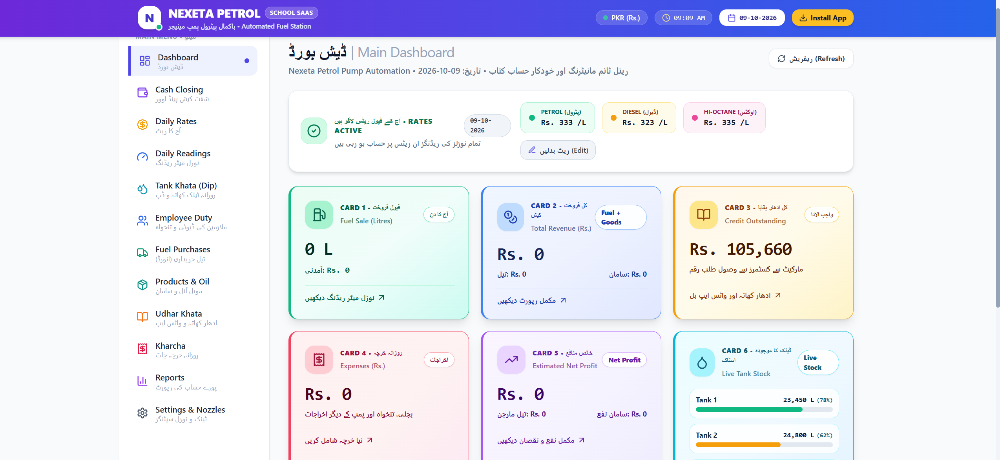

# ⛽ NEXETA PETROL - Automated Fuel Station

### پاکستان کا مکمل آٹومیٹک پٹرول پمپ سسٹم
*Live Demo:* https://nexeta-petrol.vercel.app

## ✨ Main Features - 6 Cards System
- *CARD 1:* Fuel Sale (Litres) - Daily Nozzle Reading
- *CARD 2:* Total Revenue (Rs.) - Fuel + Goods
- *CARD 3:* Credit Outstanding - Udhar Khata Rs. 105,660
- *CARD 4:* Expenses (Rs.) - Rozana Kharcha
- *CARD 5:* Net Profit - Estimated Profit
- *CARD 6:* Live Tank Stock - Tank 1 & 2 Live (78%, 62%)
- Daily Rates: Petrol Rs. 333, Diesel Rs. 323, Hi-Octane Rs. 335
- Cash Closing / Daily Rates / Daily Readings / Tank Dip / Employee Duty / Fuel Purchases / Udhar Khata / Kharcha / Reports

## 📸 Dashboard Preview

## 🛠️ Tech Stack
Next.js 14 | TypeScript | Tailwind CSS | Turso DB | Drizzle ORM | 100% Responsive | Urdu + English

## 👨💻 Developed By
*Naveed Bhatti - +923400072030*
